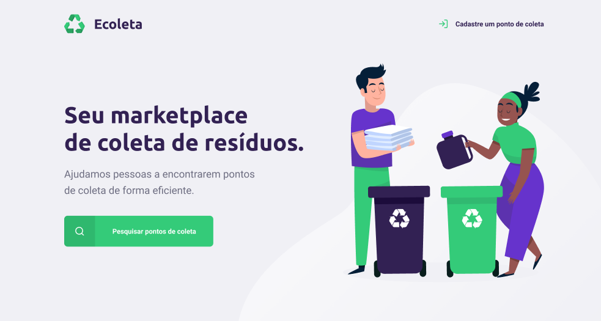

    

# Ecoleta

> Ecoleta é um projeto desenvolvido com base na semana internacional do meio ambiente. O objetivo é conectar pessoas a empresas que coletam resíduos específicos, como lâmpadas, baterias, óleo de cozinha etc

<h1 align="center">
    
</h1>

## Tecnologias

- [Node.js][nodejs]
- [TypeScript][typescript]
- [React][reactjs]
- [React Native][rn]
- [Expo][expo]